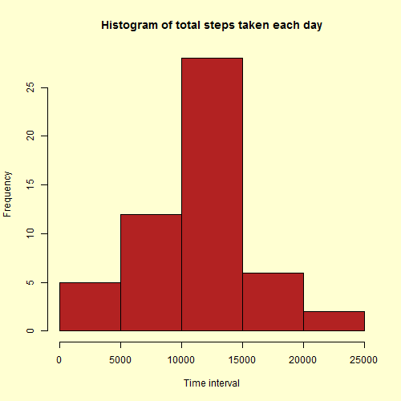
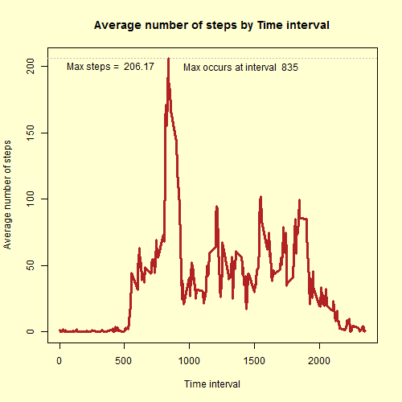
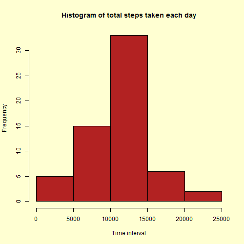
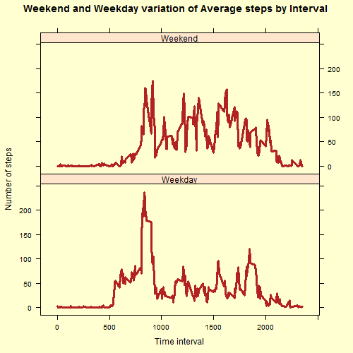

# 1. Loading and preprocessing the data


Reading from csv file the raw data...
```{r}
RawData     <- read.table("activity.csv",
               header=TRUE,
               sep=",",
               stringsAsFactors = FALSE,
               colClasses = c("numeric","Date","numeric")
               )
```

Understanding the data a little more
```{r}
dim(RawData)
head(RawData,10)
summary(RawData)
```

# 2. What is mean total number of steps taken per day?

Calculating the total number of steps taken per day
```{r}
StepsbyDay <- aggregate(steps ~ date, data = RawData, sum, na.rm = TRUE)

```

Histogram of the total number of steps taken each day
```{r}
png(filename = "figure/plot1.png",
    width = 500, 
    height = 500, 
    units = "px", 
    pointsize = 12,
    bg = rgb(255,255,210)
p <- hist(StepsbyDay$steps, main = "Histogram Steps by Day", xlab = "Steps by day", col = "lightblue")
print(p)
dev.off()
```


Calculate the mean and median of the total number steps by day
```{r}
stepMean <- mean(StepsbyDay$steps)
stepMedian <- median(StepsbyDay$steps)
```
The mean value of the number of steps is **10766.19**.

The median value of the number of steps is **10765**.

# 3. What is the average daily activity pattern?

Plot the activity pattern in 5 min interval
```{r}
library(reshape2)

actMeltInt <- melt(RawData, id.vars="interval", measure.vars="steps", na.rm=TRUE)

#Cast the data frame to see in intervals
actCastInt <- dcast(actMeltInt, interval ~ variable, mean)

#Plot the activity pattern in 5 min interval
png(filename = "figure/plot2.png", 
    width = 500, 
    height = 500, 
    units = "px", 
    pointsize = 12, 
    bg = rgb(255,255,210,maxColorValue = 255))
   
p <- plot(actCastInt$interval, actCastInt$steps, type="l", main="Frequency of Steps Taken at Each Interval", xlab="5 min Interval", ylab="Average Across All Days", col="red", lwd=1)

print(p)
dev.off()
```


Show the interval with max average steps
```{r}
actCastInt$interval[which(actCastInt$steps == max(actCastInt$steps))]
```

The interval is **835**

## 4. Imputing missing values

```{r}
#Calculating missing values
sum(is.na(RawData$steps))

#Just renaming to be more descriptive
stepsPerInt <- actCastInt

#Creating a data frame that we will remove NAs from
actNoNA <- RawData

#Merge activity data set with stepsPerInt data set
actMerge = merge(actNoNA, stepsPerInt, by="interval", suffixes=c(".act", ".spi"))

#Get list of indexes where steps value = NA
naIndex = which(is.na(actNoNA$steps))

#Replace NA values with value from steps.spi
actNoNA[naIndex,"steps"] = actMerge[naIndex,"steps.spi"]

#Melt new data frame to prep for casting by date
actMeltDateNoNA <- melt(actNoNA, id.vars="date", measure.vars="steps", na.rm=FALSE)

#Cast data frame to see steps per day
actCastDateNoNA <- dcast(actMeltDateNoNA, date ~ variable, sum)
```

Plot histogram with frequency of steps by day
```{r}
png(filename = "figure/plot3.png", 
    width = 500, 
    height = 500, 
    units = "px", 
    pointsize = 12, 
    bg = rgb(255,255,210,maxColorValue = 255))

p <- plot(actCastDateNoNA$date, actCastDateNoNA$steps, type="h", main="Histogram of Daily Steps (Imputted NA Values)", xlab="Date", ylab="Steps", col="gray", lwd=5)

print(p)
dev.off()
```
 

Calculating the mean and median
```{r}
newStepMean <- mean(actCastDateNoNA$steps)
newStepMedian <- median(actCastDateNoNA$steps)
```

Original Data Set (NA values left as is) - Mean daily steps = 10,766.19 - Median daily steps = 10,765

New Data Sets (NAs imputed with mean value for that interval) - Mean daily steps = 10,890 - Median daily steps = 11,015

On a percentage basis, the difference in results between the original and new data sets was only 1.2% and 2.3% for the mean and median, respectively. However, the maximum daily value in the set with NAs vs. the set replacing NAs was 21,194 vs. 24,150, which differed more significantly at 13.9%.

# 5. Are there differences in activity patterns between weekdays and weekends?

```{r}
# For loop to create new column called "dayOfWeek" and insert whether each date corresponds to a weekday or weekend
for (i in 1:nrow(actNoNA)) {
    if (weekdays(actNoNA$date[i]) == "sábado" | weekdays(actNoNA$date[i]) == "domingo") {
        actNoNA$dayOfWeek[i] = "weekend"
    } else {
        actNoNA$dayOfWeek[i] = "weekday"
    }
}
# To create a plot, we must first subset the data
actWeekday <- subset(actNoNA, dayOfWeek=="weekday")
actWeekend <- subset(actNoNA, dayOfWeek=="weekend")

# Next, we need to process the data for our needs
actMeltWeekday <- melt(actWeekday, id.vars="interval", measure.vars="steps")
actMeltWeekend <- melt(actWeekend, id.vars="interval", measure.vars="steps")
actCastWeekday <- dcast(actMeltWeekday, interval ~ variable, mean)
actCastWeekend <- dcast(actMeltWeekend, interval ~ variable, mean)
```

Set plot area to two rows and one column
```{r}
library(ggplot2)
library(gridExtra)
png(filename = "figure/plot4.png", 
    width = 500, 
    height = 500, 
    units = "px", 
    pointsize = 12, 
    bg = rgb(255,255,210,maxColorValue = 255))
    
plot1 <- qplot(actCastWeekday$interval, actCastWeekday$steps, geom="line", data=actCastWeekday, main="Steps by Interval - Weekday", xlab="Interval", ylab="Number of Steps")

plot2 <- qplot(actCastWeekend$interval, actCastWeekend$steps, geom="line", data=actCastWeekend, main="Steps by Interval - Weekend", xlab="Interval", ylab="Number of Steps")

p <- grid.arrange(plot1, plot2, nrow=2)
print(p)

dev.off()
```

 